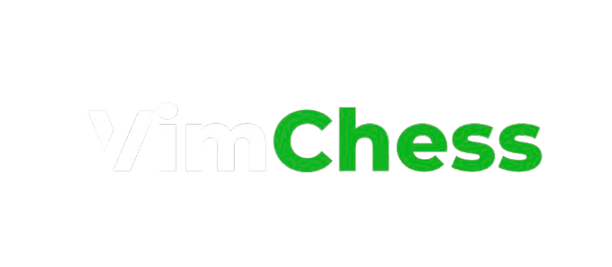

# VimChess - Application d'Échecs en Temps Réel



## À propos de VimChess

VimChess est une application moderne de jeu d'échecs en ligne développée avec Angular et Ionic. Elle permet aux joueurs de s'affronter en temps réel, de participer à un système de matchmaking, et de suivre leur progression grâce à un classement Elo.

### Fonctionnalités principales

- **Authentification complète** : Création de compte, connexion sécurisée, et gestion des profils utilisateurs
- **Matchmaking intelligent** : Mise en relation avec des adversaires de niveau similaire
- **Parties d'échecs en temps réel** : Interface réactive avec mises à jour instantanées via WebSockets
- **Chat intégré** : Communication avec votre adversaire pendant les parties
- **Statistiques de jeu** : Suivi des victoires, défaites, parties nulles et évolution du classement Elo
- **Adaptabilité multi-plateformes** : Expérience optimisée sur ordinateurs, tablettes et smartphones

## Prérequis

Avant de commencer l'installation, assurez-vous d'avoir les éléments suivants installés sur votre système :

- **Node.js** (version 18.x ou supérieure)
- **npm** (version 10.x ou supérieure)
- **Git** pour cloner le dépôt

## Installation

Suivez ces étapes pour installer et configurer VimChess sur votre machine locale :

### 1. Cloner le dépôt GitHub

```shell script
git clone https://github.com/ProjetDevUF/vimchess-frontend.git
cd VimChess-Frontend
```


### 2. Installer les dépendances

```shell script
npm install
```

Cette commande installera toutes les dépendances nécessaires, notamment Angular, Ionic et les autres packages requis.

### 3. Installer Angular CLI et Ionic CLI globalement (si ce n'est pas déjà fait)

```shell script
npm install -g @angular/cli
npm install -g @ionic/cli
```

### 4. Configuration des variables d'environnement

Créez un fichier `environment.ts` dans le répertoire `src/environments/` (s'il n'existe pas déjà) :

```typescript
export const environment = {
  production: false,
  apiUrl: 'http://localhost:4000',
};
```


## Lancement de l'application

### Développement local

Pour lancer l'application en mode développement avec rechargement automatique :

```shell script
npm start
```


ou

```shell script
ionic serve
```


L'application sera disponible à l'adresse `http://localhost:4200/` dans votre navigateur.

### Construction pour la production

Pour créer une version optimisée pour la production :

```shell script
npm run build
```

ou

```shell script
ionic build --prod
```

Les fichiers générés seront disponibles dans le répertoire `www/`.

## Déploiement sur les appareils mobiles

### Android

```shell script
ionic capacitor add android
ionic capacitor copy android
ionic capacitor open android
```

### iOS (requiert macOS et Xcode)

```shell script
ionic capacitor add ios
ionic capacitor copy ios
ionic capacitor open ios
```


## Structure du projet

```
VimChess-Frontend/
├── src/                        # Code source de l'application
│   ├── app/                    # Composants, services et modules Angular
│   │   ├── models/             # Interfaces et types
│   │   ├── scenes/             # Pages de l'application
│   │   ├── service/            # Services (auth, socket, etc.)
│   │   └── guards/             # Gardes de routes
│   │   └── service/            # Services de l'application
│   ├── assets/                 # Images, icônes et autres ressources statiques
│   ├── environments/           # Configuration d'environnement
│   └── theme/                  # Thèmes et styles globaux
├── .gitignore                  # Fichiers ignorés par Git
├── angular.json                # Configuration Angular
├── capacitor.config.ts         # Configuration Capacitor
├── ionic.config.json           # Configuration Ionic
├── package.json                # Dépendances et scripts npm
├── tailwind.config.js          # Configuration Tailwind CSS
└── tsconfig.json               # Configuration TypeScript
```

## Développeurs

Ce projet a été développé par :
- [KANTIN-FAGN](https://github.com/KANTIN-FAGN) - Développeur principal du frontend
- [Juliendnte](https://github.com/Juliendnte) - Développeur principal du backend

---
